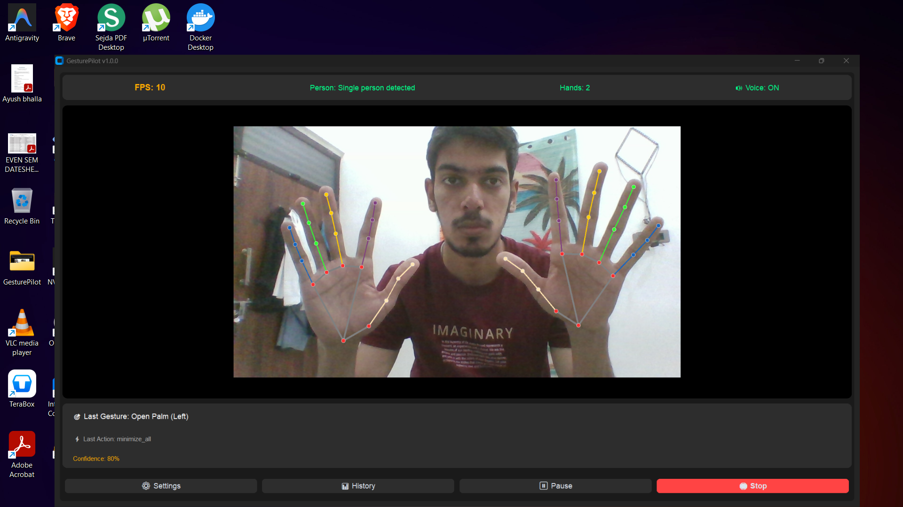

# GesturePilot 🚀

GesturePilot is a powerful, modular, and real-time gesture control system for your PC. It uses computer vision (OpenCV and MediaPipe) to detect hand landmarks and translate finger movements into system actions, allowing you to control your computer without touching it.



## ✨ Key Features

- **🎯 Precision Hand Tracking**: Leverages MediaPipe for high-accuracy hand landmark detection.
- **🎨 Modern Dark Mode GUI**: Sleek and intuitive interface built with custom UI components.
- **🛠️ Action Execution**: Control system functions like Volume, Media, and more via simple hand gestures.
- **📊 Activity History**: Track all recognized gestures and executed actions in a detailed history log.
- **⚙️ Advanced Settings**: Customize detection thresholds, cooldowns, and interface preferences.
- **🔊 Voice Feedback**: Optional audio confirmation for recognized gestures.
- **🚀 Auto-Start Support**: Seamlessly integrate into your Windows startup for quick access.

## 📋 Prerequisites

Before running GesturePilot, ensure you have:
- **Python 3.8 or higher** installed.
- A functional **Webcam**.
- Windows OS (some action executors are Windows-specific).

## 🚀 Installation

1. **Clone the Repository**:
   ```bash
   git clone https://github.com/AyushBhalla05/GesturePilot.git
   cd GesturePilot
   ```

2. **Create a Virtual Environment** (Recommended):
   ```bash
   python -m venv venv
   source venv/Scripts/activate  # On Windows: venv\Scripts\activate
   ```

3. **Install Dependencies**:
   ```bash
   pip install -r requirements.txt
   ```

## 🎮 Usage

Simply run the main script to launch the application:

```bash
python main.py
```

### 🖐️ Gesture Controls

The system distinguishes between left and right hands, providing a wide range of controls:

#### ➡️ Right Hand (Primary Actions)

| Gesture | Action | Description |
|:---:|---|---|
| 👆 | **Open YouTube** | Launches YouTube in your default browser |
| ✌️ | **Play/Pause** | Toggle media playback (Music/Video) |
| 🤟 | **Volume Up** | Increase system volume |
| 🖖 | **Calculator** | Open the Windows Calculator |
| 🖐️ | **Screenshot** | Capture and save a screenshot |
| ✊ | **Stop** | Neutralize or stop the current action |
| 👍 | **Brightness Up**| Increase display brightness |

#### ⬅️ Left Hand (System & Browser)

| Gesture | Action | Description |
|:---:|---|---|
| 👆 | **New Tab** | Open a new tab in your browser (Ctrl+T) |
| ✌️ | **Close Tab** | Close the current browser tab (Ctrl+W) |
| 🤟 | **Volume Down** | Decrease system volume |
| 🖖 | **Notepad** | Open Windows Notepad for quick notes |
| 🖐️ | **Minimize All**| Show Desktop / Minimize all windows |
| ✊ | **Next Track** | Skip to the next media track |
| 👍 | **Brightness Down**| Decrease display brightness |

*(Note: These mappings can be customized in `gesture_library.json`)*


## 📂 Project Structure

```text
GesturePilot/
├── main.py                # Entry point
├── hand_detector.py       # MediaPipe integration
├── gesture_recognizer.py  # Gesture logic
├── action_executor.py     # System control logic
├── ui_manager.py          # GUI implementation
├── settings_panel.py      # Configuration interface
├── history_manager.py     # Data logging
├── config_manager.py      # Settings management
└── requirements.txt       # Dependencies
```

## 🛠️ Configuration

You can customize the behavior of GesturePilot by editing `exported_config.json` or using the **Settings** panel within the application:
- Adjust **Confidence Threshold** to reduce false positives.
- Change **Resolution** for better performance on older hardware.
- Toggle **Skeleton Display** and **Voice Feedback**.

## 🤝 Contributing

Contributions are welcome! If you have ideas for new gestures or features, feel free to:
1. Fork the project.
2. Create your Feature Branch (`git checkout -b feature/AmazingFeature`).
3. Commit your changes (`git commit -m 'Add some AmazingFeature'`).
4. Push to the branch (`git push origin feature/AmazingFeature`).
5. Open a Pull Request.

## 📄 License

This project is licensed under the MIT License - see the [LICENSE](LICENSE) file for details.

---
Built with ❤️ by [Ayush Bhalla](https://github.com/AyushBhalla05)
